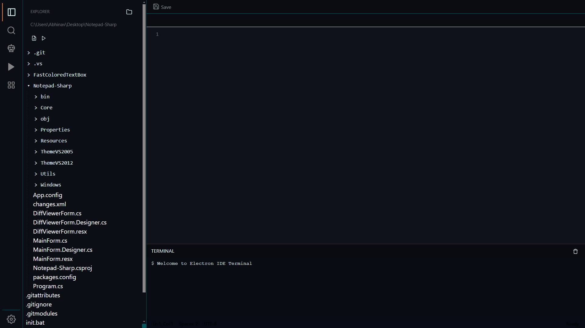

# 🧠 Unified Compiler - Language Agnostic Development Platform

## 🚀 Overview

**Unified Compiler** is a powerful, extensible, and language-agnostic development platform that compiles and executes code in multiple programming languages through a single unified interface. Designed for developers, educators, and enthusiasts, it streamlines cross-language development by combining a multi-language terminal, intelligent code understanding, and backend compiler APIs.



---

## 🎯 Features

* ✅ **Unified Terminal Interface** for all languages
* 🧠 **AI-Layer Integration** (LLM) for code explanation, bug detection, and suggestions
* 🔧 **Dynamic Compiler API** backend for seamless execution
* 💻 **Multi-language Support**: C, C++, Python, Java, JavaScript, Go, Rust, etc.
* 🦨 **Smart Snippets & Auto-detection** of language based on file/extension
* 🔒 **Secure Sandbox** environment for running untrusted code
* 📊 **Modular UI** for editing, compiling, debugging, and viewing output

---

## 🏧 Architecture

```
+-------------------------+
|      Terminal UI        |
+-------------------------+
            |
            v
+-------------------------+
|     LLM Layer (AI)      | <-- Optional: LLM-based analysis & insights
+-------------------------+
            |
            v
+-------------------------+
|   Compiler Engine API   | <-- Routes code to appropriate compiler
+-------------------------+
            |
            v
+-------------------------+
|     Language Runtimes   | (gcc, g++, python, java, go, etc.)
+-------------------------+
```

---

## 🔌 Supported Languages (Initial Phase)

* C / C++
* Python
* Java
* JavaScript (Node.js)
* Go
* Rust
* Bash

---

## 🧑‍💻 Usage

1. **Write or Paste Code** into the editor or terminal.
2. **Select Language** or let the system auto-detect it.
3. **Compile & Run** – the output appears in the terminal pane.
4. **Get AI Insights** (optional): Explain code, debug, optimize.

---

## 🛠️ Installation

### Prerequisites

* Node.js, npm (for frontend)
* JavaScript (LLM integration)
* Git

### Clone and Run

```bash
git clone https://github.com/helloitsmeabhi/uclad.git
cd uclad
cd uclad-ui
npm install
npm start
```


---

## 🧠 AI Layer (Optional)

The AI Layer leverages LLMs (e.g., GPT, LLaMA, Ollama, or local models) to:

* Explain what the code does
* Fix common bugs
* Offer optimization suggestions
* Generate your API key from Google Gemini

---

## 📁 Project Structure

```
uclad/
🔹 uclad-ui/          # Terminal UI and code editor (HTML/JS/CSS)
🔹 uclad-i/           # Compiler API logic (C++)
```
> “One Compiler to rule them all.” — Unified Compiler
